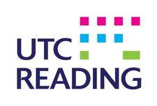
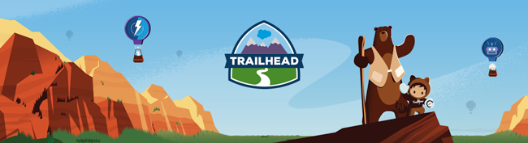

##  Salesforce Student Group Introduction

### Wednesday 10th October 2018

|  Duration   |              Activity              |                           Content                            |
| :---------: | :--------------------------------: | :----------------------------------------------------------: |
| 9:00- 9:20  |            Introduction            | Introduce yourself and the leadership team.  Talk about the purpose of Student Groups. Introduce Salesforce at a high-level Introduce Trailhead as the fun way to learn Salesforce  Introduce the Trailblazer Community as the way to build their network Play introduction videos. |
| 09:20-9:40  |   Getting Started with Trailhead   | Introduce Salesforce at a lower-level. Register accounts. Setup Trailhead and Trailblazer profiles - write description and add photo. |
| 9:40-10:15  |     Trailhead Badge Collection     | Recommend these Trailmixes, but allow students to choose own: Student Groups Getting Started Trailmix Student Groups Salesforce Basics Trailmix Student Groups Ohana Culture Trailmix Student Groups Soft Skills Trailmix Student Groups Hands-on Activities Trailmix |
| 10:15-10:45 |               Break                |                                                              |
| 10:45-11:45 | Trailhead Badge Collection (cont.) |                                                              |
| 11:45-12:45 |              Project               | Students work in groups or independently to create a salesforce solution, to be presented at 14:40. Part of this time can be used to practice skills to use in their project if required. Hand out project suggestion sheets. Must setup collaborative orgs at beginning. |
| 12:45-13:15 |               Lunch                |                                                              |
| 13:15-14:40 |          Project (cont.)           |                                                              |
| 14:40-15:40 |  Project Presentations / Feedback  | Students will present the project they have been working on throughout the day and will receive feedback. |
| 15:40-16:00 |             End talks              | Pitch enrichment Get feedback from participants - write on whiteboard. |